# - 手动编译安装，并配置，正常运行以下系统 -


## 1. **linux**

* 版本号：Ubuntu 18.04
---

## 2. **Nginx**

  （1）更新软件源

  ```
 sudo apt-get update
  ```
  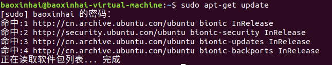
  
  （2）安装nginx
  ```
  sudo apt-get install nginx
  ```
   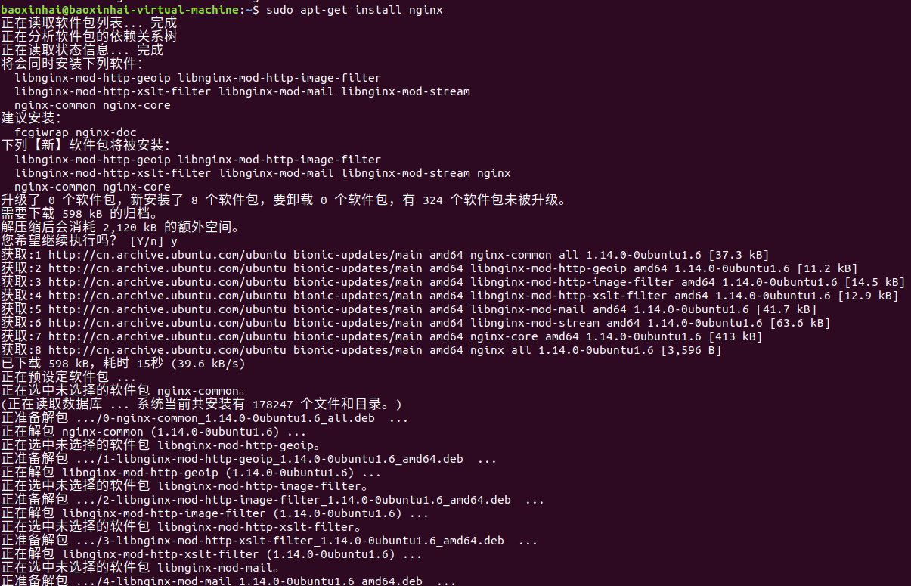 
  
  （3）检查配置文件是否正确&&配置nginx
  
   检查配置文件是否正确：
  ```
  nginx -t
  ```
  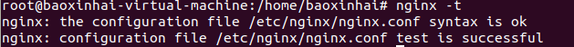
  
  ---
  **容易出现的问题**：如果不在root用户下，会显示
  permission denied ； 所以我们要切换到root用户以获取权限

---
  配置文件：
  ```
  sudo vi /etc/nginx/nginx.conf
  把user www.data改为user root
  ```
  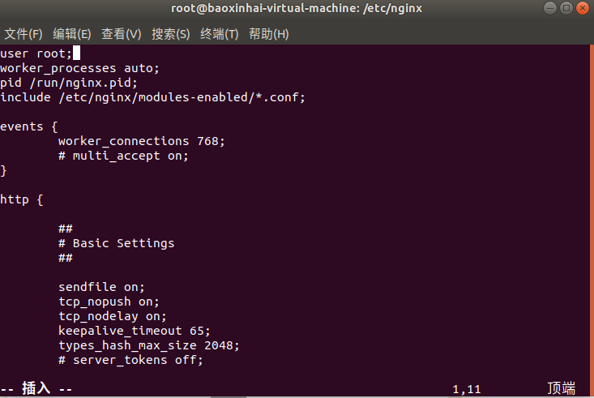

  ---
  /etc/nginx 下的配置文件结构
  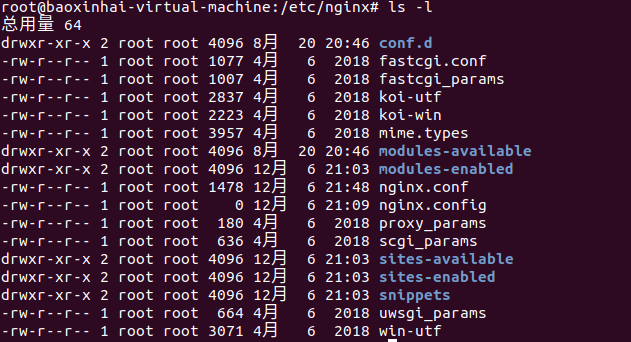

  （4）启动nginx服务
   ```
    sudo /etc/init.d/nginx start
   ```
   

  （5）浏览器启动nginx服务
  在浏览器中输入localhost
  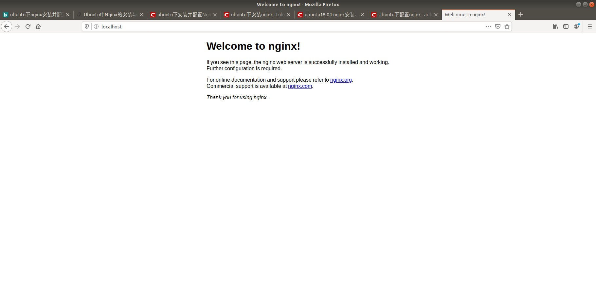

  （6）其他命令
  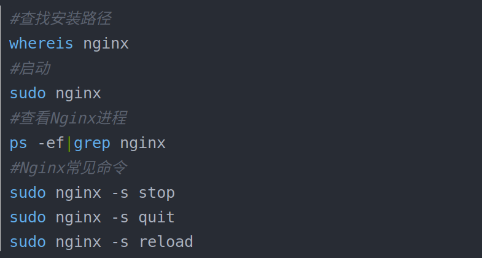

  ---

  
## 3. **Mysql**
 （1）首先检查系统中是否安装了mysql
  ```
  sudo netstart -tap|grep mysql
  ```
  没有反应，没有显示已安装结果

   （2）安装mysql
   ```
   sudo apt-get install mysqp-server mysql-server
   ```
   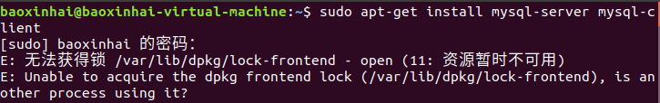

   ---
   **问题出现** ：E：无法获得锁 /var/lib/dpkg/lock-fronted(11: 资源不可用)

   **问题原因** ：在ubuntu系统的termial下，用apt-get install 安装软件的时候，如果在未完成下载的情况下将terminal close。此时 apt-get进程可能没有结束。结果，如果再次运行apt-get install 命令安装如今，可能会发生下面的提示：
 
 无法获得锁 /var/lib/dpkg/lock - open (11: 资源暂时不可用)
无法锁定管理目录(/var/lib/dpkg/)，是否有其他进程正占用它？


   **问题解决** ：
   ```
   ps -aux
   ```
   找到含有apt-get的进程id号
   ```
   sudo kill id
   ```
   问题即可解决

---
 再次执行上述的安装操作指令
 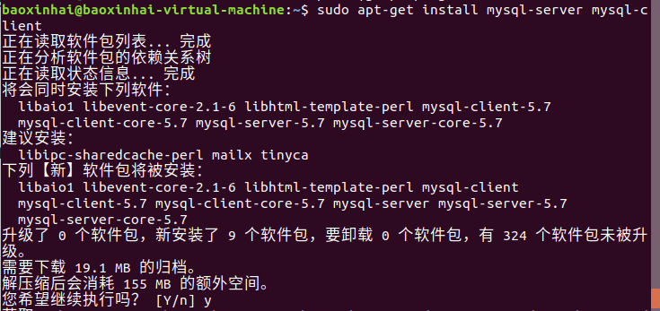
 成功安装mysql

 （3）测试安装是否成功&&本地登录mysql测试
 ```
 sudo netstat -tap|grep mysql
 mysql -uroot -p
 ```
 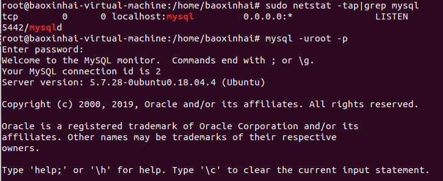

 （4）对数据库进行简单操作 创建和查看操作
 ```
 create database bxh;
 shwget http://php.net/distributions/php-7.2.2.tar.gz ow databases;
 ```
 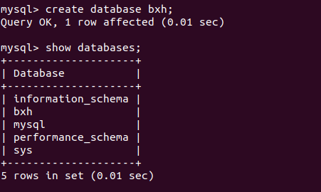

---
## 4.**Php**
(1)下载php文件
```
wget https://php.net/distributions/php-7.2.2.tar.gz
```
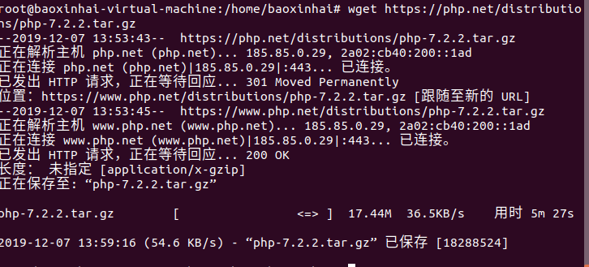
（2）解压
```
tar -zxvf php-7.2.2.tar.gz
```
（3）进入解压目录
```
cd php-7.2.2
```
（4）预编译
```
sudo ./configure --prefix=/usr/local/php --with-config-file-path=/usr/local/php/etc --enable-fpm
```
---
**出现的问题**：

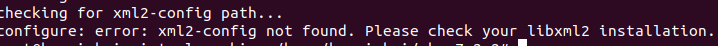
**问题原因**：

没有安装libxml2

**问题解决**：
```
 sudo apt-get install libxml2
 sudo apt-get install libxml2-dev
```

---
重新执行预编译指令后：
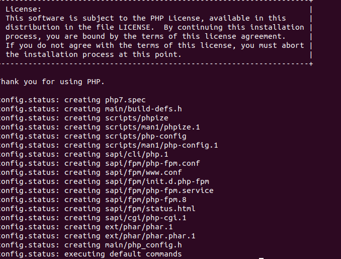

（5）编译php
```
sudo make
```
！！！经历了**很长一段时间**的编译，终于编译成功了，大约花了十分钟左右，电脑CPU 被占用了不少，风扇的声音也十分大


（6）安装php
```
sudo install php
```
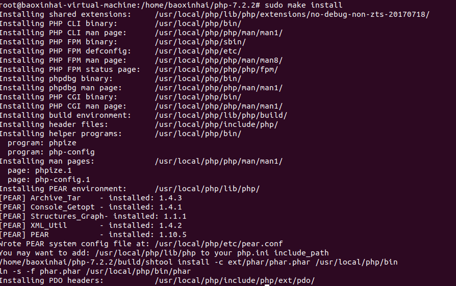
（7）修改配置文件
```
cd /usr/local/php/etc 
sudo cp php-fpm.conf.default php-fpm.conf 
cd /usr/local/php/etc/php-fpm.d 
sudo cp www.conf.default www.conf 
```

添加www用户和组
```
sudo groupadd www 
sudo useradd -g www www 
```
修改www.conf中的所属组和用户
```
user=www
group=www
```
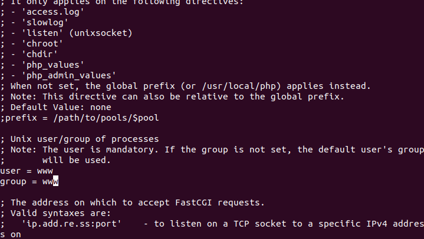

（8）修改nginx.conf以支持php-fpm

（9）创建php测试文件
在/usr/local/nginx/html 下创建index.php文件
 ```
 <?php
  echo phpinfo();
 ?>
 ```
 （10）启动php-fpm服务 nginx服务已启动
 ```
 /usr/local/php/sbin/php-fpm start
 ```
 （11）访问浏览器
 http://localhost/index.php
 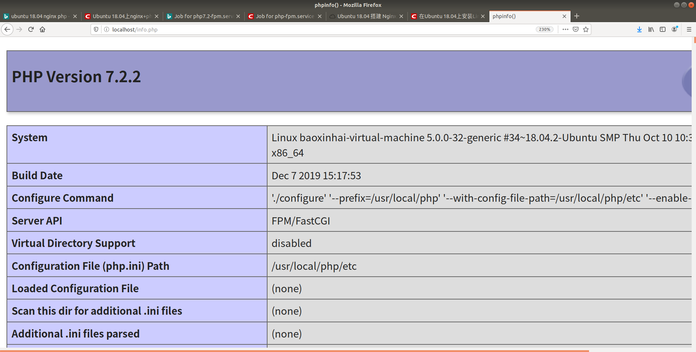
 


## 5.**Wordpress**

（1）准备安装wordpress数据库

   *以root身份进入mysql*
```
sudo mysql -u root
```
 *创建一个wordpress数据库*
 ```
 create database wordpress;
```
*创建一个用户bxh授予他wordpress数据库的全部权限*
```
create user 'bxh' identified by '1113';
grant all privileges on wordpress.* to 'bxh';
```
*退出*
```
quit
```

（2）下载wordpress安装包
```
wget https://cn.wordpress.org/wordpress-4.7.4-zh_CN.zip
```
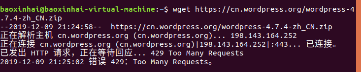

---
**出现的问题**：错误429：Too many requests.

**问题的原因**：
1. 近几日有中国大陆的流量对 wordpress.org 发起猛烈攻击。

2. 攻击导致其官网CDN面向大陆的反代服务器Nginx针对该域名自动停摆。

3. 官网有的爱好者并不知道面向大陆的CDN所处情况，他们自己能访问所以认为没问题。

**问题的解决**：

1. 复制WordPress下载地址

   英文版地址：https://wordpress.org/latest.zip

   中文版地址：https://cn.wordpress.org/latest-zh_CN.zip

2. 打开下载软件（比如：迅雷 ），新建下载任务

3. 复制粘贴上面的下载地址即可正常下载了。

   最后，通过X-FTP上传最新版WordPress程序来覆盖手动更新即可。
---
（3）将wordpress安装包解压，放置到nginx服务器的根目录，这里是/var/www/html/wordpress

（4）在浏览器中输入*https://localhost/wordpress*,会自动开始wordpress的安装

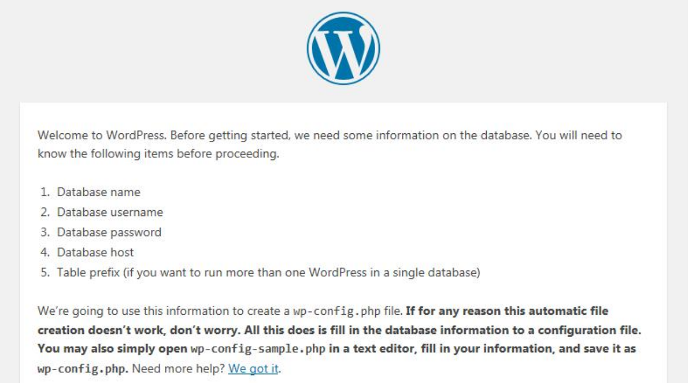

（4）点击let's go，然后按照之前在mysql里面创建的wordpress数据库填写相应的username和password，然后点击submit按钮进行下一步

（5）在之前nginx根目录“/var/www/html/wordpress”目录下面新建一个wp-config.php文件，将下面高亮部分的代码复制到wp-config.php文件里面，然后点击“Run the installation”按钮进行下一步安装。
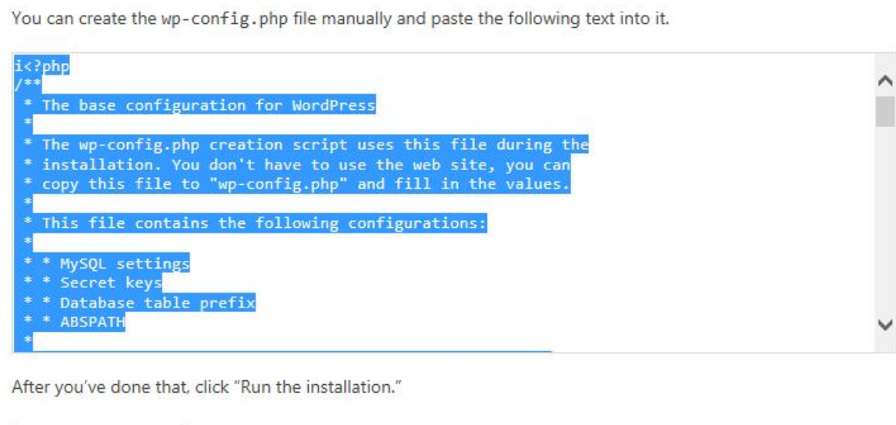

（6）填写网站名称，后台管理员用户名，后台密码，联系邮箱信息，并且点击同意申明，然后点击“Install Wordpress”按钮，开始正式的安装wordpress程序

---
**出现的问题及解决**：*“Discourage search engines from indexing this site”这个选项不能勾选，不然的话搜索引擎就不会收录wordpress站点了！*
---
---
（7）安装成功，然后输入数据库中设置的用户名和密码即可进入到wordpress的后台

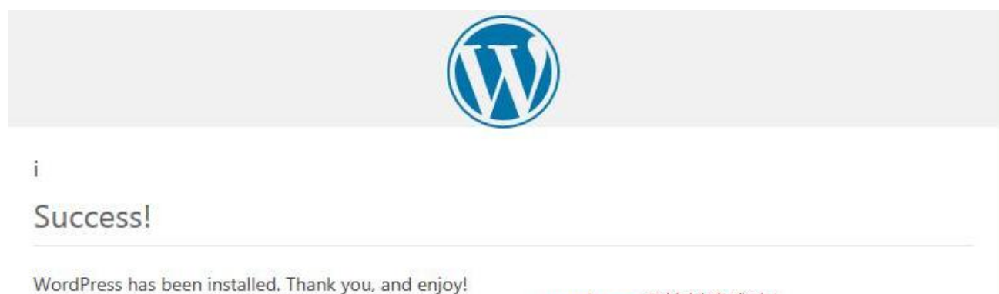

（8）成功安装wordpress

ps：关于wordpress的简单介绍

**WordPress是使用PHP语言开发的博客平台，用户可以在支持PHP和MySQL数据库的服务器上架设属于自己的网站。也可以把 WordPress当作一个内容管理系统（CMS）来使用。
WordPress是一款个人博客系统，并逐步演化成一款内容管理系统软件，它是使用PHP语言和MySQL数据库开发的,用户可以在支持 PHP 和 MySQL数据库的服务器上使用自己的博客。**  --百度百科

---
总结：经过了上述安装与配置，我们成功的搭建了lnmp环境+wordpress，在安装和配置的过程了更加熟悉了linux下的shell指令编程以及linux的文件组织结构，了解了各个文件夹的作用和功能，为深入的理解linux和linux这门课的学习打下了良好的基础。通过自己动手配置安装，不仅锻炼了我们的动手能力，还在记录安装编译开发的过程中锻炼了我们文档的书写能力，如何组织好自己的配置过程并且用文档形式记录是十分重要的，为今后的更好的学习linux打下了良好的基础。


